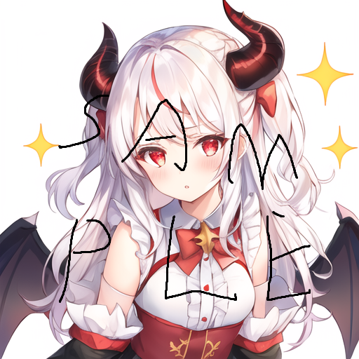
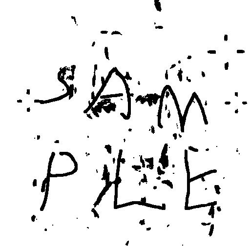
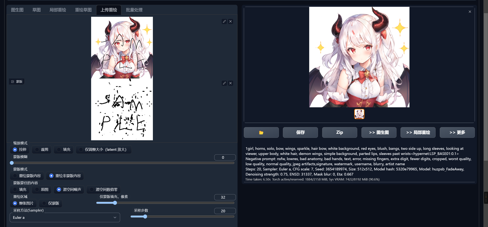

# DeWm
受够了满图的水印？来，看这里。  
使用AI（StableDiffusion）自动去除插画图片上的水印。  

声明：本仓库中的示例图片都是我自己跑的。去除图片上的水印不意味着你自动取得对图片的使用授权。  
更重要的，去除水印意味着修改图片，这是许多许可证中不允许的。请勿滥用此仓库中提供的模型！  

训练方法：无可奉告。  

使用方法：  
1，用dev.py处理原始图片，得到mask。  
2，在sd中选择局部重绘，上传mask。  
就这么简单！  

拉参技巧（不绝对，可以自己摸）：  
1，选择画风相似的模型，可以极大地改善成品画质。  
2，不要使用蒙版模糊。最多设置1~2。合理地调整函数自带的数学形态学操作就可以拓展蒙版。  
3，极端情况下，宁可多选也不要漏选。大不了用画图把模型误判的区域抹白，也比手动描黑水印简单的多。  
4，如果是半透明水印，蒙版蒙住的内容选原图。否则，选填充。  
5，我推荐Euler a采样20步。  
6，CFG拉低拉低拉低。能拉2别拉3。以图不崩为唯一目的。否则风格会很ai。如果你喜欢ai味可以无视。  
7，幅度0.2，最高0.25。否则必崩。因为这是精细蒙版。  

其他用法：  
重绘后也可以消除来自水印的边缘。因此如果你想搞CtrlNet，可以先按标准流程去水印，再从去水印图里面计算边缘。  

TODO：  
如果可能，做一个独立于SD的（或者基于SD的）通用风格重绘模型。  

示例：  
原始图片：  
  
计算出的mask（按理说是可以涂白误判的，但是演示时就不了）：  
  
SD重绘：  

